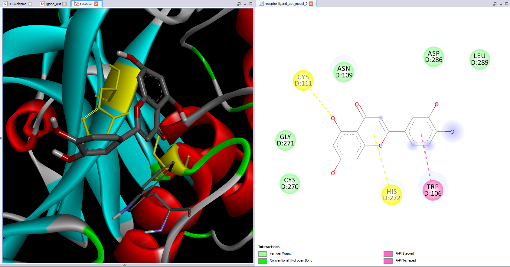

# Docking-Molecular
Repositório com algoritmos e notebooks de docking molecular.

# *Diário de Bordo* 

## *04/11* 
A partir de hoje começo um diário de bordo narrando parte do meu trabalho no projeto de docking molecular. Alguns códigos já foram criados antes do início desse diário, porém pretendo apresentar isto posteriormente.
Hoje, vou começar apresentando o resultado de um docking que eu fiz na PLPro do vírus Sars-Cov-2 utilizando o fármaco Luteolin, que a priori é um ligante que apresentou bons resultados nos artigos que eu li. 
Segundo o artigo "The SARS-coronavirus papain-like protease: Structure, function and inhibition by designed antiviral compounds" o sítio ativo do SARS-CoV-1 fica localizando na região Cys112–His273–Asp287, então o docking será feito nessa região. Perceba que, esse não é o SARS-CoV-2, mas sim um vírus anterior muito parecido com esse da epidemia de 2020.
Para consulta posterior, ultilizando o AutodockVina tomei exhaustiveness = 100.

O resultados foram,

| mode \| | affinity          | dist from  | best mode |
|---------|-------------------|------------|-----------|
|      \| | energy (kcal/mol) | rmsd l.b.  | rmsd u.b. |
| 1       | -6.0              | 0.000      | 0.000     |
| 2       | -6.0              | 2.575      | 3.445     |
| 3       | -5.9              | 1.663      | 2.598     |
| 4       | -5.8              | 2.224      | 6.407     |
| 5       | -5.7              | 2.012      | 2.303     |
| 6       | -5.6              | 2.461      | 6.063     |
| 7       | -5.6              | 2.265      | 6.027     |
| 8       | -5.6              | 1.296      | 1.599     |
| 9       | -5.4              | 2.849      | 4.265     |

Vamos analisar o primeiro modo.

